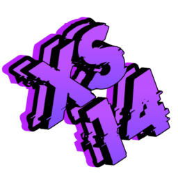

# X Station

  

  

[English](#english) | [Русский](#русский) | [Server Rules](Resources/ServerInfo/Gameplay.txt) | [Introduction](Resources/ServerInfo/Intro.txt)

---

# 🚀 X Station [RU]

X Station - это уникальный проект от команды Etharion Team, представляющий собой форк Space Station 14 с глубоким погружением в атмосферу космического фронтира. Здесь каждый найдет свое место: от простого шахтера до опытного инженера, исследуя новые горизонты мультистанционных возможностей!

## ✨ Особенности проекта

- 🌟 **Улучшенная система освещения**
  > Полностью переработанная система света, вдохновленная Eclipse Station

- 🎯 **Продвинутая баллистика**
  > Новая система обработки снарядов и баллистики

- 🗣️ **Система TTS**
  > Реалистичная система преобразования текста в речь

- 🤖 **Искусственный интеллект**
  > Интеграция GPT 3.5/4 в:
  > - Вендинговые автоматы с личностью
  > - Умных уборщиков (Чистоботы)
  > - Развлекательных роботов (Хонкоботы)
  > - Мимов-роботов
  > - Персональных ИИ

- 🔄 **Бесконечные смены**
  > Уникальная система непрерывной игры

- 🌍 **Мультистанционность**
  > Взаимодействие между разными станциями

## 🎮 Особенности сервера
- Medium-Hard RP
- Система вайтлиста
- Активное комьюнити
- Регулярные обновления

## ⚠️ Правовая информация
Данная сборка доступна исключительно для изучения в личных некоммерческих целях. Коммерческое использование разрешено только создателям, состоящим в команде Etharion Team.

---

# 🚀 X Station [EN]

X Station is a unique project by Etharion Team, representing a Space Station 14 fork with deep immersion in the space frontier atmosphere. Here, everyone will find their place: from simple miners to experienced engineers, exploring new horizons of multi-station possibilities!

## ✨ Project Features

- 🌟 **Enhanced Lighting System**
  > Completely reworked lighting system, inspired by Eclipse Station

- 🎯 **Advanced Ballistics**
  > New projectile and ballistics processing system

- 🗣️ **TTS System**
  > Realistic text-to-speech system

- 🤖 **Artificial Intelligence**
  > GPT 3.5/4 Integration in:
  > - Personality-driven vending machines
  > - Smart cleaners (Cleanbots)
  > - Entertainment robots (Honkbots)
  > - Mime robots
  > - Personal AIs

- 🔄 **Endless Shifts**
  > Unique continuous gameplay system

- 🌍 **Multi-Station Features**
  > Inter-station interactions

## 🎮 Server Features
- Medium-Hard RP
- Whitelist system
- Active community
- Regular updates

## ⚠️ Legal Information
This build is available exclusively for personal, non-commercial study purposes. Commercial use is permitted only for creators who are members of the Etharion Team.

---

**Powered by [Space Station 14](https://github.com/space-wizards/space-station-14) & [Robust Toolbox](https://github.com/space-wizards/RobustToolbox)**

